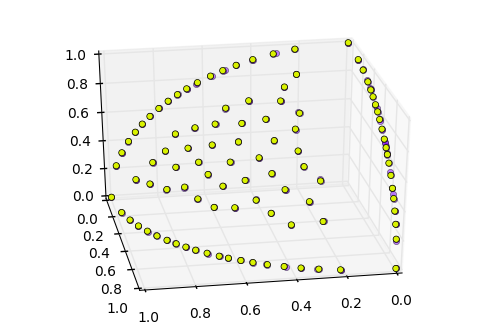

# MooViz

MooViz (**M**ulti-**o**bjective **o**ptimisation **Viz**ualisations) stores the objective values produced by Multi-Objective Evolutionary Algorithms. Visualisation is one of the great challenges for Muti-Objective Problems, specially when working with problems consisting of 4 or more objectives.

## Organisation of repoistory

This repository will be re-organised at some point, but for now there is only a single data-set.

**/lambda** folder contains the candidate solutions up for consideration at each generation, i.e. they are competing to survive in the next generation and produce offspring.

**/mu** folder contains the parent solutions, these are solutions which have survived and will producing the lambda solutions.

**/fig** folder contains my own plots of the mu and lambda solutions.

**/gif** folder contains my own ffmpeg GIF output of my /fig folder (ffmpeg -i %d.png output.gif). Uploaded to [gfycat](https://gfycat.com/EnragedLikelyBarnacle) too.

Each folder contains output at each iteration of the optimisation process.

## Optimisation algorithm

The algorithm used to generate these results is CMA-PAES-HAGA. This is a many-objective optimisation algorithm.  Open-access paper can be found [here](http://eprints.bournemouth.ac.uk/24371/)

@article{rostami2016covariance,
  title={Covariance matrix adaptation pareto archived evolution strategy with hypervolume-sorted adaptive grid algorithm},
  author={Rostami, Shahin and Neri, Ferrante},
  journal={Integrated Computer-Aided Engineering},
  volume={23},
  number={4},
  pages={313--329},
  year={2016},
  publisher={IOS Press}
}

The problem being solved is [DTLZ2](http://people.ee.ethz.ch/%7Esop/download/supplementary/testproblems/dtlz2/index.php)

@book{deb2005scalable,
  title={Scalable test problems for evolutionary multiobjective optimization},
  author={Deb, Kalyanmoy and Thiele, Lothar and Laumanns, Marco and Zitzler, Eckart},
  year={2005},
  publisher={Springer}
}
